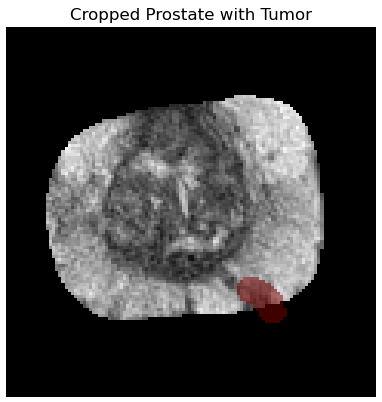
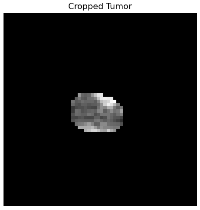

# Prostate Cancer Aggressiveness Prediction using PET/MRI scans

## Introduction
Prostate cancer, with over 1.6 million cases and 350,000 deaths annually worldwide, ranks among the top cancers affecting men [1]. Traditional diagnosis methods, such as ultrasound-guided needle biopsies, not only carry inherent risks but often underestimate the tumor's aggressiveness [2]. However, standard positron emission tomography (PET) imaging, especially with PSMA-PET, demonstrates promise in identifying suspicious lesions during biopsies [3, 4]. 

This project's primary goal is to harness the power of PET and multi-parametric MRI images to predict Gleason scores. These scores provide an accurate assessment of prostate cancer aggressiveness, eliminating the need for risky invasive biopsies. Building upon recent research at Technical University of Munich, which showcased promising outcomes predicting Gleason scores from handcrafted radiomic features [5], we aim to create an end-to-end deep learning pipeline that predicts tumor aggressiveness directly from various imaging modalities.

## Dataset
We have exclusive access to a new dataset containing PSMA-11 PET/MRI scans, tumor segmentation maps, and detailed pathological information. Moreover, supplementary public data can be accessed through the PI-CAI Challenge.

## Setup
### 1. Connect to ADLM ssh server
```
ssh <username>@131.159.110.3
```

### 2. Clone this repository
```
git clone https://gitlab.lrz.de/FloWeiser/prostate-cancer-aggressiveness-prediction.git
```

### 3. Change into repository directory
```
cd prostate-cancer-aggressiveness-prediction/
```

### 4. Create a symbolic link for the datasets
```
ln -s /local_ssd/practical_wise24/prostate_cancer data
```

### 5. Create and activate conda environment

The project contains two environment yml files in order to create two different conda environments. One environment keeps the dependencies for the training pipeline and notebooks. The second one is used for both training and inference of NNUNet model for segmentation masks

```
module load python/anaconda3
conda env create -f ./main_env.yml
conda env create -f ./segmentation_env.yml
conda activate ProstateCancer
```

### 6. Login to Weights & Biases

### 7. Start training on GPU
```
cd src
conda deactivate ProstateCancer
sbatch run_training.sh
```


## Run Preprocessing Scripts
The dataset is already preprocessed and stored on the server. The preprocessing pipeline is not needed to reproduce results.

### 1. Run preprocessing pipeline (notebooks in src/notebooks/preprocessing)  
This step will take a few hours.

### 2. Start prostate gland inference  
First, run the following notebook: notebooks/segmentation/01_gland_segmentation_prepare.ipynb

Afterwards, inference can be started with:
```
cd src
sbatch run_prediction_nnunet.sh
```
Afterwards, run the notebooks 02_prostate_gland_extraction.ipynb and 03_extracted_prostate_gland_visualizer.ipynb

### 3. Start prostate lesion training  
First, run 04_lesion_segmentation_prepare.ipynb notebook. Next, run:
```
sbatch run_training_picai.sh
```
The prostate lesion segmentation training will take around 5 days.

### 4. Start prostate lesion inference on private dataset  
```
sbatch run_lesion_inference.sh
```
After inference is completed, run the remaining notebooks in the segmentation folder consecutively (starting with 05_lesion_extraction.ipynb).


## Configuration File
The training configuration file can be found at ```src/config/config.yaml```.

### Available Models
- MEDICALNET: Uses a separate pretrained MedicalNet for each channel (=modality)
- RADIMAGENET_1_SLICE: Uses ResNet50's for each channel (=modality), which are pretrained on RadImageNet
- RADIMAGENET_3_SLICES: Using a pretrained ResNet50 on RadImageNet with shared weights for all slices
- DENSENET_3D: DenseNet 3D implementation
- SIMPLE_CNN_3D: Simple CNN architecture with 4 convolutional layers
- THREE_SLICE_CNN: Simple CNN architecture for the 3 slice dataset

### Available Datasets

| Dataset Name        | Description | Compatible Models                                  | Data Shape       | Additional Info                                  |
|---------------------|-------------|----------------------------------------------------|------------------|--------------------------------------------------|
| PRIVATE_1_SLICE     | 2D slices of the private dataset, cropped to prostate, with T2W, ADC, PET and the tumor segmentation mask as channels | RADIMAGENET_1_SLICE                                | (4, 1, 120, 120) |                                                  |
| PICAI_1_SLICE       | 2D slices of the private dataset, cropped to prostate, with T2W, ADC, DWI and the tumor segmentation mask as channels | RADIMAGENET_1_SLICE                                | (4, 1, 120, 120) | This dataset only works with num_classes=3       |
| PRIVATE_PROSTATE    | 3D volumes of the private dataset, cropped to prostate, with T2W, ADC, PET and the tumor segmentation mask as channels | MEDICALNET                                         | (4, 30, 99, 92)  |                                                  |
| PRIVATE_ONLY_TUMOR  | 3D volumes of the private dataset, masked out prostate tumor, with T2W, ADC and PET channels | MEDICALNET, DENSENET_3D, SIMPLE_CNN_3D             | (3, 30, 99, 92)  |                                                  |
| PICAI_ONLY_TUMOR    | 3D volumes of the PI-CAI dataset, masked out prostate tumor, with T2W, ADC and DWI channels | MEDICALNET, DENSENET_3D       | (3, 8, 60, 60)  | This dataset only works with num_classes=3       |
| PICAI_3_SLICE       | 3 consecutive slices of the PICAI dataset with the largest tumor area, masked out the tumor | RADIMAGENET_3_SLICES, THREE_SLICE_CNN              | (3, 3, 60, 60)   | This dataset only works with num_classes=3       |

You can view images of the 2D datasets (PRIVATE_1_SLICE and PICAI_1_SLICE) with `notebooks/visualize_transforms_2d.ipynb`.  
For 3D models, please use `notebooks/visualize_transforms.ipynb`

#### Cropping Visualizations



## Hyperparameter Tuning
You can start a hyperparameter tuning run using ```sbatch run_training.sh --use_sweep```.
The hyperparameter search space can be defined in the trainin.py file

## K-Fold Cross Validation
To cross validate a model, use ```sbatch run_training.sh --cross_val_splits=CROSS_VAL_SPLITS --cross_val_output_path=CROSS_VAL_OUTPUT_PATH```. This will perform k-fold cross validation with the parameters in your config.yaml (at the end of the predefined number of epochs) and save the results to CROSS_VAL_OUTPUT_PATH.

## Experiment: Pretrain with Autoencoder

1. Train the autoencoder
```
cd src/encoder
sbatch run_enoder.sh
```
The corresponding hyperparameters can be adapted in encoder/encoder_training.py

2. Use the encoded images for training
```
sbatch run_classifier.sh
```
The corresponding hyperparameters can be adapted in encoder/train_encoded.py

## References
1. [Global Burden of Disease Cancer Collaboration, 2017](https://www.ncbi.nlm.nih.gov/pmc/articles/PMC6103527/)
2. [Cohen et al., 2008](https://www.sciencedirect.com/science/article/abs/pii/S0302283808003412)
3. [Fendler et al., 2017](https://link.springer.com/article/10.1007/s00259-017-3670-z)
4. [Maurer et al., 2016](https://www.nature.com/articles/nrurol.2016.26)
5. [Solari et al., 2021](https://link.springer.com/article/10.1007/s00259-021-05430-z)
